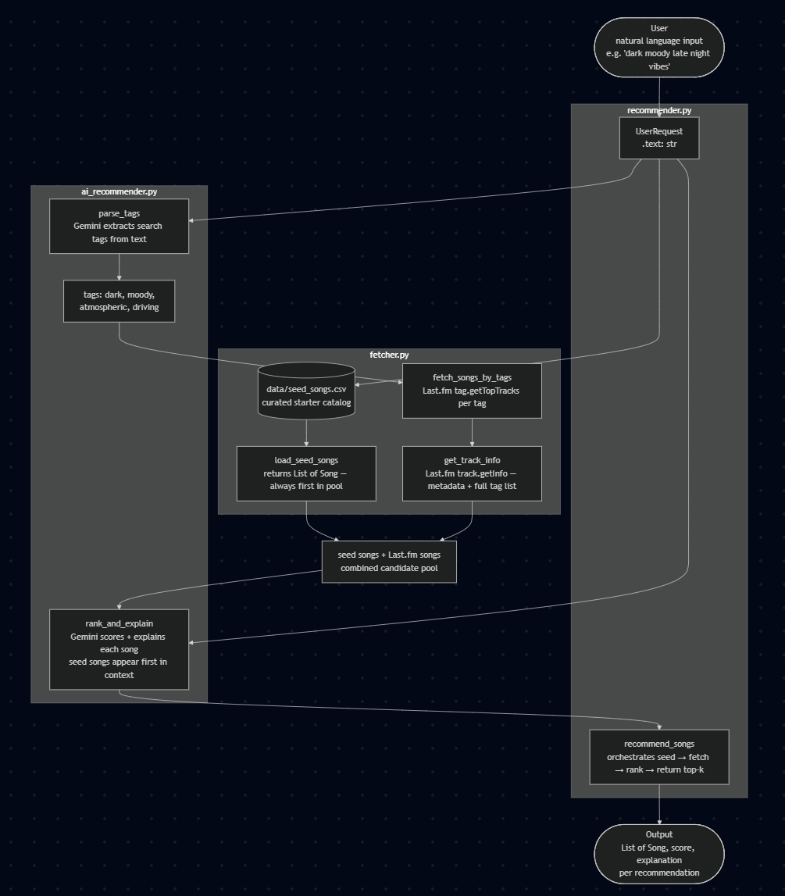
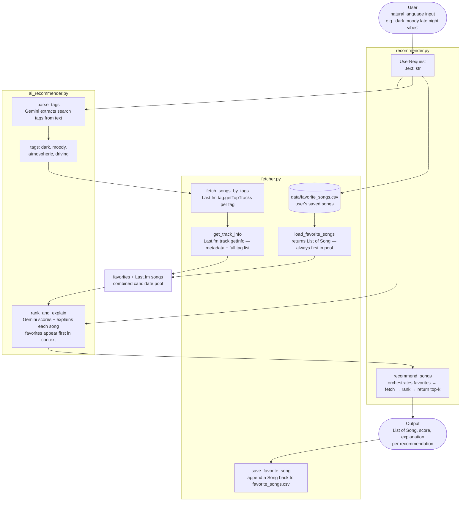

# System Architecture

```mermaid
flowchart TD
    A([User\nnatural language input\ne.g. 'dark moody late night vibes']) --> B

    subgraph recommender.py
        B[UserRequest\n.text: str]
        J[recommend_songs\norchestrates favorites → fetch → rank → return top-k]
    end

    B --> FAV
    B --> C

    subgraph fetcher.py
        FAV[(data/favorite_songs.csv\nuser's saved songs)]
        FAV --> FAVOUT[load_favorite_songs\nreturns List of Song — always first in pool]
        SAVE[save_favorite_song\nappend a Song back to favorite_songs.csv]
        C2[fetch_songs_by_tags\nLast.fm tag.getTopTracks per tag]
        C2 --> F[get_track_info\nLast.fm track.getInfo — metadata + full tag list]
    end

    subgraph ai_recommender.py
        C[parse_tags\nGemini extracts search tags from text]
        C --> D[tags: dark, moody,\natmospheric, driving]
        I[rank_and_explain\nGemini scores + explains each song\nfavorites appear first in context]
    end

    D --> C2

    FAVOUT --> MERGE
    F --> MERGE
    MERGE[favorites + Last.fm songs\ncombined candidate pool]

    MERGE --> I
    B --> I
    I --> J

    J --> K([Output\nList of Song, score, explanation\nper recommendation])
    K --> SAVE
```
